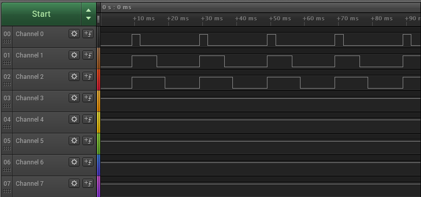

= Attaching a PCA9685 PWM controller via I2C

This example code shows how to interface the Raspberry Pi Pico to the PCA9685 PWM controller. This device uses I2C for communications, and is happy running at either 3.3 or 5v. The Raspberry Pi RP2040 GPIO's work at 3.3v so that is what the example uses.

[[PCA9685_test]]
[pdfwidth=75%]
.Test Diagram for PCA9685.

== List of Files

CMakeLists.txt:: CMake file to incorporate the example in to the examples build tree.
pca9685_i2c.cpp:: The example code.
pca9685_i2c.h:: PCA9685 class code.

== Bill of Materials

.A list of materials required for the example
[[PCA9685-bom-table]]
[cols=3]
|===
| *Item* | *Quantity* | Details
| Breadboard | 1 | generic part
| Raspberry Pi Pico | 1 | https://www.raspberrypi.com/products/raspberry-pi-pico/
| PCA9685 board| 1 | generic part
| M/M Jumper wires | at least 6 for one channel + i2c connection | generic part
|===
